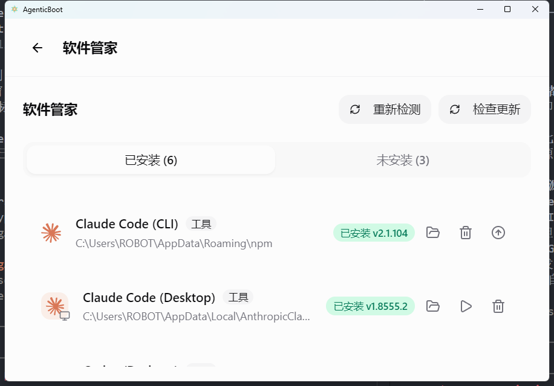
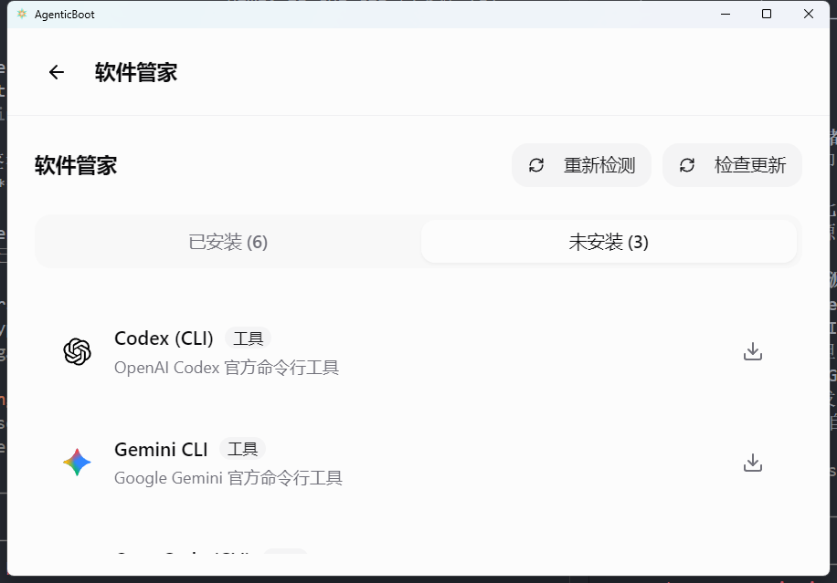

# AgenticBoot

[中文](#中文) | [English](#english)

## 中文

### AgenticBoot 是什么

AgenticBoot 是一个 AI 工具装机与管理器，目前优先实现 Windows。

它的目标不是再做一个“工具列表”，而是把人们真正开始使用 AI 工具之前最麻烦的一段先解决掉：先检测你机器上已经能用的东西，避免重复安装；再把你真正需要的工具补齐；最后把安装、卸载、状态查看和后续管理统一到一个入口里。

这个项目基于 [CC Switch](https://github.com/farion1231/cc-switch) 二次开发，在保留其既有基础能力的同时，把当前研发重心明显转向 AgenticBoot 自己新增和重度改造的装机、安装检测、工具管理能力。

### 愿景

我们希望 AgenticBoot 最终实现的是：

**让所有人类，不管懂不懂 AI、会不会编程，都能够便捷地使用各种 AI 工具。**

这意味着它不应该只服务已经熟悉命令行、环境变量和安装细节的人，也不应该默认用户知道每个工具背后的依赖关系、平台差异和配置方式。

围绕这个目标，AgenticBoot 会持续朝这些方向推进：

- 降低第一次接触 AI 工具时的理解和安装门槛
- 让已经会用一部分工具的人也能更顺手地扩展和管理自己的工具箱
- 尽量把检测、安装、卸载、状态查看和后续管理收束到一个一致入口
- 让安装过程尽可能透明，不把关键状态和失败原因藏在黑箱里

### 它想解决的核心问题

今天很多 AI 编码工具都默认用户已经准备好了 Node.js、Git、Python、npm、PowerShell、系统 PATH，或者默认用户愿意自己处理每个工具的 Windows 差异。

AgenticBoot 想把这些碎片化步骤收束成一个更统一的体验：

- 检测优先，而不是默认重装
- 尽量复用已有可用环境，而不是强行接管
- 对外部已安装工具和 AgenticBoot 自己管理的工具做统一视图
- 在 Windows 上优先走真实可用的官方安装路径，而不是只停留在占位支持

### 现在你能得到什么

当前这一阶段，项目重点非常明确：**先把 Windows 装机链路做扎实。**

目前已经落地的价值包括：

- 安装前自动检测 `Node.js`、`Git` 和已支持 AI 工具是否已可用
- 已有可用安装时跳过重复安装，减少时间浪费和环境污染
- 能在统一管理页中识别 AgenticBoot 管理的安装和系统里原本就存在的外部安装
- 提供统一的卸载管理流程，而不是要求用户回到每个工具各自的卸载方式里摸索
- 最近一轮改动重点增强了安装过程反馈，让 `Wizard` 和 `Manager` 两条主流程里都能更连续地看到活动状态、进度变化和日志上下文

### 项目来源

AgenticBoot 不是从零开始另起炉灶，而是在 CC Switch 现有桌面应用和工具基础上做增量二开。

这也意味着：

- 它继承了 CC Switch 的一部分架构和既有能力
- 它当前最核心的新增方向，已经转向 AgenticBoot 自己的装机、检测和工具管理主线
- README 会优先解释 AgenticBoot 现在想解决什么，而不是展开介绍全部上游背景

### 当前现状

AgenticBoot 目前是 **Windows-first** 项目，但这不是平台取舍的终点，而是实现顺序上的优先级。

- Windows：核心装机、检测、安装管理链路已在持续实现中，也是当前最优先落地的平台
- macOS：不是不做，当前已有框架基础，后续会继续补齐真实安装能力
- Linux：不是不做，当前已有框架基础，后续会继续补齐真实安装能力

这意味着如果你今天来体验 AgenticBoot，最值得关注的是它在 Windows 上对真实安装流程的处理；macOS 和 Linux 则属于明确在路线图中、但还未完成同等实现深度的部分。

### 下载安装使用（普通用户）

如果你只是想把 AgenticBoot 下载下来直接用，不需要先拉源码，也不需要先研究命令行。当前最推荐的方式是直接从 GitHub Releases 下载 Windows 发布包：

[AgenticBoot Releases](https://github.com/unbound9527/agenticboot/releases)

#### 推荐下载方式

- **不会选就下载 `.msi` 安装版**：适合绝大多数用户，双击安装即可。
- **想免安装就下载 `Portable.zip` 绿色版**：解压后直接运行，适合临时试用或不想写入安装信息的情况。

#### 5 步傻瓜式操作

1. 打开上面的 Releases 页面。
2. 找到最新版本，在资源列表里下载 Windows 包。
3. 如果你下载的是 `.msi`，双击后一路按提示安装；如果你下载的是 `Portable.zip`，先解压，再双击里面的程序启动。
4. 第一次运行时，如果 Windows 弹出安全提示，先点“更多信息”，再点“仍要运行”。
5. 进入 AgenticBoot 后，优先从 `Wizard` 开始。它会先帮你检测机器上已经能用的环境和工具，再提示你补齐缺失项。已经装过的工具，通常会尽量复用，避免重复安装。

#### 常见问题

- **我该下 `.msi` 还是绿色版？**  
  不确定就选 `.msi`。绿色版更适合想解压即用、不想走安装流程的用户。

- **提示“Windows 已保护你的电脑”怎么办？**  
  这是 Windows 对未广泛分发应用的常见提示。确认下载来源是本仓库 Releases 页面后，点击“更多信息” → “仍要运行”即可。

- **需要我先手动装 `Node.js`、`Git`、`Python` 吗？**  
  一般不需要。AgenticBoot 的目标就是先检测、再复用、再补齐。像 `Node.js`、`Git` 等依赖会优先检测现有环境，部分工具也支持由 AgenticBoot 直接拉起受管运行环境。

- **macOS / Linux 也能按这个方法直接用吗？**  
  当前不建议把这套“傻瓜式主流程”理解为跨平台已完整可用。AgenticBoot 目前优先打磨的是 Windows 主链路，macOS / Linux 仍在逐步补齐中。

- **我想自己从源码运行怎么办？**  
  那属于开发者用法，往下看 README 里的“开发启动”即可。

### 软件管家

软件管家是 AgenticBoot 的工具管理中心，统一查看已安装和可安装的 AI 工具：

**已安装工具：**



**可安装工具：**



### 当前已支持的 Windows 能力

#### 依赖检测与复用

- 检测并复用已可用的 `Node.js`
- 检测并复用已可用的 `Git`
- 检测已存在的 CLI / 桌面工具，避免不必要重装

#### 桌面应用安装

- Claude Desktop
- Codex desktop app
- OpenCode desktop app

#### CLI 工具安装

- Claude Code
- Codex CLI
- Gemini CLI
- OpenCode CLI
- OpenClaw
- Hermes

#### 工具级安装策略

- OpenCode CLI 在 Windows 上直接提取 `opencode-ai` 已发布包里的 `opencode.exe`，不依赖 WSL，也不要求用户先装 Node.js
- OpenClaw 在 Windows 上走官方 PowerShell 安装路径
- Hermes 在 Windows 上走官方 PowerShell 安装路径，不要求用户先手装 Python

### AgenticBoot 如何看待“已安装”

AgenticBoot 区分两类安装：

- **Managed installs**：安装在 AgenticBoot 选定目录下，由 AgenticBoot 直接管理
- **External installs**：系统里原本就存在的安装，由 AgenticBoot 检测到并接入统一视图

这带来的好处是：

- 你已经装过的工具可以直接复用
- AgenticBoot 不会轻易冒充自己“拥有”系统外部目录
- 只有受管目录里的内容才会进入自动清理边界，降低误删风险

### 后续预计推进

接下来项目大概率会继续沿着这条主线推进：

- 继续完善 Windows 安装链路的稳定性、检测准确度和卸载一致性
- 继续打磨 `Wizard` 与 `Manager` 的装机反馈体验，让状态、日志和结果更直观
- 扩展更多工具的真实可用安装与检测能力
- 在 Windows 主链路稳定后，再逐步补齐 macOS / Linux 的非占位实现

### 适合谁关注这个项目

如果你符合下面任一类场景，AgenticBoot 会比较值得关注：

- 你想在 Windows 上更快搭起 AI 编码环境
- 你不想为每个 AI 工具单独处理依赖和安装细节
- 你已经装过部分工具，但还希望统一查看和管理状态
- 你更在意“真实可用的装机流程”，而不是只有概念上的跨平台支持

### 开发启动

如果你要在本地启动桌面应用，建议直接使用仓库自带脚本。它会按仓库声明的 Node.js / `pnpm` 版本准备运行环境。

```powershell
.\scripts\dev-desktop.ps1
```

或：

```bat
scripts\dev-desktop.cmd
```

常用命令：

```bash
pnpm typecheck
pnpm test:unit
pnpm dev
```

### 相关文档

- Tool docs: [docs/tools/README.md](./docs/tools/README.md)
- Windows install design: [docs/superpowers/specs/2026-05-08-windows-one-click-install-design.md](./docs/superpowers/specs/2026-05-08-windows-one-click-install-design.md)
- Install activity feedback design: [docs/superpowers/specs/2026-05-11-install-activity-feed-design.md](./docs/superpowers/specs/2026-05-11-install-activity-feed-design.md)
- Implementation plan: [docs/superpowers/plans/2026-05-08-windows-one-click-install.md](./docs/superpowers/plans/2026-05-08-windows-one-click-install.md)

---

## English

### What AgenticBoot Is

AgenticBoot is an installer and manager for AI tools, with Windows implemented first.

It is not just a catalog of apps. The goal is to make the hardest part before people can actually use AI tools much less painful: detect what is already usable on the machine, avoid redundant installs, install only what is still missing, and keep installation, uninstall, status visibility, and follow-up management in one place.

The project is derived from [CC Switch](https://github.com/farion1231/cc-switch). While it keeps part of that foundation, the current development focus has clearly shifted toward AgenticBoot's own installation, install-detection, and tool-management work.

### Vision

AgenticBoot is built around a broader goal:

**help every human use a wide range of AI tools conveniently, whether they understand AI or know how to code.**

That means it should not only work for people who are already comfortable with terminals, environment variables, package managers, and platform-specific setup details. It should also lower the barrier for people who simply want AI tools to work.

To move toward that goal, AgenticBoot keeps pushing in these directions:

- reduce the learning and setup barrier for first-time AI tool users
- make it easier for more advanced users to expand and manage their toolset without friction
- bring detection, installation, uninstall, status visibility, and follow-up management into one consistent entry point
- keep installation transparent instead of hiding important state and failure reasons inside a black box

### The Problem It Tries To Solve

Many AI coding tools still assume the user already has Node.js, Git, Python, npm, PowerShell, PATH setup, and enough patience to navigate each tool's Windows-specific quirks.

AgenticBoot tries to turn that fragmented experience into a more unified one:

- detection first instead of reinstall first
- reuse working local environments instead of taking ownership by force
- show AgenticBoot-managed installs and externally detected installs in one management flow
- prefer real, working Windows install paths over placeholder support

### What You Can Get Today

At this stage, the project is intentionally focused: **make the Windows install flow solid first.**

What is already valuable today:

- automatic detection of usable `Node.js`, `Git`, and supported AI tools before installation
- skipping redundant installs when a working local installation already exists
- a unified management view for both AgenticBoot-managed installs and tools that were installed outside AgenticBoot
- a unified uninstall flow instead of forcing users to rediscover each tool's original uninstall path
- recent work has improved install feedback in both `Wizard` and `Manager`, making activity, progress, and log context feel more continuous during installs

### Project Origin

AgenticBoot is not a greenfield app. It is an incremental fork built on top of the existing CC Switch desktop app and tool foundation.

That matters because:

- part of the architecture and existing capabilities come from CC Switch
- the most important new direction now lives in AgenticBoot's own install, detection, and tool-management path
- this README prioritizes explaining AgenticBoot's current product direction instead of retelling the full upstream background

### Current Status

AgenticBoot is currently a **Windows-first** project, but that reflects implementation priority, not a decision to ignore macOS or Linux.

- Windows: the core detection, install, and management flows are actively implemented and are the main delivery focus today
- macOS: not abandoned; the project already has scaffolding and is expected to gain fuller install support later
- Linux: not abandoned; the project already has scaffolding and is expected to gain fuller install support later

If you are evaluating the project today, the most accurate reading is that Windows is the first deeply implemented platform, while macOS and Linux remain part of the intended product direction and will be expanded after the Windows path is stronger.

### Download And Use (Regular Users)

If you just want to download AgenticBoot and start using it, you do not need to clone the repo or set up a dev environment first. The recommended path today is to download the Windows release package directly from GitHub Releases:

[AgenticBoot Releases](https://github.com/unbound9527/agenticboot/releases)

#### Recommended Download Option

- **If you are unsure, choose the `.msi` installer**: best for most users, just double-click and install.
- **Choose `Portable.zip` if you want a no-install build**: extract and run directly.

#### Simple 5-Step Flow

1. Open the Releases page above.
2. Download the latest Windows package from the asset list.
3. If you downloaded the `.msi`, double-click it and follow the installer. If you downloaded `Portable.zip`, extract it first and run the app inside.
4. If Windows shows a safety warning on first launch, click "More info" and then "Run anyway".
5. After AgenticBoot opens, start with `Wizard`. It will detect what is already available on your machine first, then guide you through anything still missing.

#### FAQ

- **Should I choose `.msi` or portable?**  
  If you are not sure, choose `.msi`. Portable is mainly for users who prefer extract-and-run without a standard install flow.

- **Do I need to install `Node.js`, `Git`, or `Python` myself first?**  
  Usually no. AgenticBoot is designed to detect, reuse, and then fill gaps where needed.

- **Can I follow the same beginner flow on macOS or Linux?**  
  Not yet as the main recommended path. AgenticBoot is currently focused on making the Windows flow solid first.

- **What if I want to run from source instead?**  
  That is the developer path. See the "Development Startup" section below.

### Software Manager

The Software Manager is AgenticBoot's tool management hub — view all installed and available AI tools in one place:

**Installed tools:**


**Available tools:**


### Current Windows Support

#### Dependency Detection And Reuse

- detect and reuse working `Node.js`
- detect and reuse working `Git`
- detect existing CLI and desktop installations to avoid unnecessary reinstalls

#### Desktop App Installs

- Claude Desktop
- Codex desktop app
- OpenCode desktop app

#### CLI Installs

- Claude Code
- Codex CLI
- Gemini CLI
- OpenCode CLI
- OpenClaw
- Hermes

#### Tool-Specific Notes

- OpenCode CLI extracts the published `opencode.exe` from the `opencode-ai` package on Windows, so it does not depend on WSL or a preinstalled Node.js runtime
- OpenClaw follows the official PowerShell install path on Windows
- Hermes follows the official Windows PowerShell installer, so users do not need to preinstall Python first

### How AgenticBoot Treats Existing Installs

AgenticBoot distinguishes between two kinds of installs:

- **Managed installs**: created under the install root selected for AgenticBoot
- **External installs**: already present elsewhere on the system and detected by AgenticBoot

That distinction matters because it lets AgenticBoot:

- reuse tools you already have
- avoid pretending it owns unrelated system directories
- keep automatic cleanup scoped to the managed install root instead of risking overreach

### What We Expect To Push Next

The near-term direction is likely to stay on this line:

- keep improving Windows install stability, detection accuracy, and uninstall consistency
- keep refining install feedback in `Wizard` and `Manager`, with clearer state, logs, and outcomes
- expand real install and detection coverage across more tools
- fill in macOS and Linux with non-placeholder implementations after the Windows path is solid

### Who This Project Is For

AgenticBoot is especially relevant if you:

- want to get an AI coding environment running faster on Windows
- do not want to manually resolve dependency and install details for every tool
- already have some tools installed and still want a unified view of what is usable
- care more about real install behavior than broad but shallow platform claims

### Development Startup

To run the desktop app locally on Windows, use the repository-managed startup script. It prepares the runtime using the Node.js and `pnpm` versions declared by the repo.

```powershell
.\scripts\dev-desktop.ps1
```

Or:

```bat
scripts\dev-desktop.cmd
```

Common commands:

```bash
pnpm typecheck
pnpm test:unit
pnpm dev
```

### Related Docs

- Tool docs: [docs/tools/README.md](./docs/tools/README.md)
- Windows install design: [docs/superpowers/specs/2026-05-08-windows-one-click-install-design.md](./docs/superpowers/specs/2026-05-08-windows-one-click-install-design.md)
- Install activity feedback design: [docs/superpowers/specs/2026-05-11-install-activity-feed-design.md](./docs/superpowers/specs/2026-05-11-install-activity-feed-design.md)
- Implementation plan: [docs/superpowers/plans/2026-05-08-windows-one-click-install.md](./docs/superpowers/plans/2026-05-08-windows-one-click-install.md)
